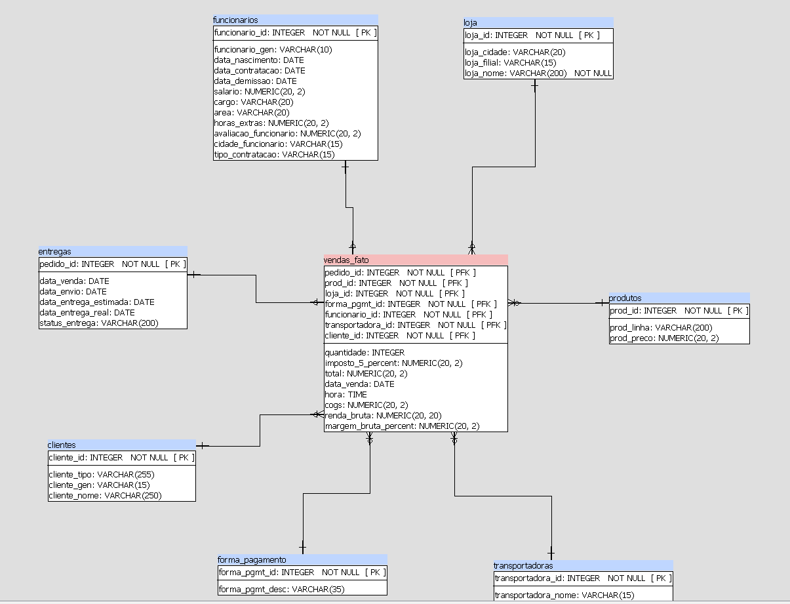

                        SISTEMA INTEGRADO DE VAREJO (Grocery Store/Retail Data Warehouse)

-----------------------------------------------------------------------

                                        Cliente / Empresa:
                                Razão social: Jotate Comercial de Alimentos Ltda
                                CNPJ: 67.753.962/0001-92
                                Nome fantasia: Mercado e Açougue Gaúcho
                                Responsáveis: Danieli Alcântara | Lucas Alcântara
                                Segmento de Negócio: Varejo de Alimentos

-----------------------------------------------------------------------

                     PROJETO INTEGRADOR III - CURSO BIG DATA PARA NEGÓCIOS / FATEC IPIRANGA

### **Proposta pedagógica:**
Desenvolver um Data Warehouse e aplicar técnicas de Data Mining utilizando recursos de Inteligência Artificial e Estatística para gerar informações em níveis estratégicos.

### **Professores envolvidos:**
* Coordenador do Projeto: [Izaias Porfirio](https://www.linkedin.com/in/izaiasporfiriofaria/)
* Coordenador do Curso Big Data: [Antonio Guardado](https://www.linkedin.com/in/antonio-fernando-nunes-guardado-7bb40b135/)
* Programação em Banco de Dados: [Rodrigo Bossini](https://www.linkedin.com/in/rodrigobossini/)
* Estatística e Probabilidade II: [Antonio Silva](https://www.youtube.com/@danisaslu)
* Gestão de Projetos: [Ana Serra](https://www.linkedin.com/in/ana-paula-gon%C3%A7alves-serra-a4a345/)
* Inteligência Artificial II: [Carlos Menezes](https://www.linkedin.com/in/cedmenezes/)
* Redes de Computadores: [Aletéia Souto](https://www.linkedin.com/in/aleteia-souto-835573157/)
* Inteligência Competitiva: [Antonio Lobosco]()

  
### **Etapas:** 
  

### **Modelagem:**
  

                                        TIME DE DESENVOLVEDORES

<table>
  <tr>
    <td align="center">
      
       
      **William Santos**
    </td>
    <td align="center">
      
       
      **Guilherme Matheus**
    </td>
    <td align="center">
      
       
      **Everton Santos**
    </td>
    <td align="center">
      
       
      **Alexandre Rodrigues**
    </td>
  </tr>
</table>
  
-----------------------------------------------------------------------
                                                 RESUMO
                                    
> Este projeto de conclusão semestral foca no desenvolvimento e implementação do Sistema Integrado de Varejo para um mercado, com ênfase na criação de um data warehouse, na aplicação de ferramentas de Business Intelligence e Inteligência Artificial para a análise de vendas. O estudo incluiu um levantamento detalhado de informações sobre a empresa, o mercado e as tecnologias utilizadas, complementado por uma análise bibliográfica.
>
> O objetivo principal do estudo é demonstrar como tecnologias avançadas de análise e visualização de dados podem melhorar a tomada de decisões estratégicas por meio de inteligência de mercado e análises. O trabalho detalha o processo de escolha e implementação de ferramentas de ETL, a modelagem do Data Warehouse, a arquitetura de Business Intelligence proposta e a elaboração de análises estatísticas. O objetivo geral é aprimorar as estratégias empresariais através da análise de dados e, também, visa a integração de ferramentas de Business Intelligence e Inteligência Artificial para gerar insights profundos que aprimorem as estratégias e inteligência competitiva da loja.

                                                  ABSTRACT
                                    
> This semester-end project focuses on the development and implementation of the "Sistema Integrado de Vendas" for a grocery store, with an emphasis on the creation of a data warehouse, the application of Artificial Intelligence and Business Intelligence tools for sales analysis. The study included a detailed survey of information about the company, the market, and the technologies used, complemented by a bibliographic analysis.
> 
> The main objective of the study is to demonstrate how advanced data analysis and visualization technologies can improve strategic decision-making through market intelligence and analyses. The work details the process of selecting and implementing ETL tools, modeling the data warehouse, proposing the Business Intelligence architecture, and developing statistical analyses. The general objective is to enhance business strategies through data analysis, and it also aims to integrate Artificial Intelligence and Business Intelligence tools to generate deep insights that improve the store's strategies and competitive intelligence.
                            

-----------------------------------------------------------------------
                                             ANÁLISE DE NEGÓCIOS
                                          
> A Jotate Comercial de Alimentos Ltda. iniciou suas atividades no ano de 1992. A empresa atua no setor de comércio varejista de mercadorias em geral, com predominância em produtos alimentícios, padaria e confeitaria de produção própria. Sendo uma empresa de pequeno porte (minimercado) localizada em bairro residencial, o estabelecimento é conhecido por oferecer uma variedade de mercadorias alimentares.

> ### **Objetivo da empresa**:
> 
> * Fornecer produtos alimentícios saudáveis e de qualidade para a comunidade local.
>  
> * Estabelecer parcerias com produtores locais
>
> * Expandir nossa presença no mercado local através de análise de dados e inteligência competitiva.

> ### **Missão, Visão e Valores**:
> 
> A Jotate Comercial de Alimentos Ltda. tem como missão fornecer alimentos de alta qualidade, promovendo o bem-estar e a saúde dos clientes, buscando ser mais do que um simples ponto de venda e almejando ser um aliado na busca por uma vida mais saudável. Esse objetivo é alcançado ao oferecer produtos que atendem às necessidades nutricionais e de sabor dos consumidores.
> 
> A empresa almeja ser reconhecida como a principal escolha de varejo alimentar em suas localidades para aqueles que valorizam uma alimentação saudável. A empresa mantém um compromisso constante com a qualidade, inovação e serviço excepcional ao cliente.
>
> Assim, mantendo a qualidade e a saúde em todas as suas operações, a empresa sustenta o compromisso firme de oferecer produtos de alta qualidade e frescos, com uma seleção cuidadosa de fornecedores e atenção aos detalhes em cada etapa do processo. Acredita-se que promover escolhas alimentares saudáveis é essencial para a qualidade de vida dos clientes.

> ### **Logotipo**:
>
>  

-----------------------------------------------------------------------
                                              GESTÃO DE PROJETO

> ### **Cronograma:**
>                                           
> Conforme destacado no Guia PMBOK (PMI, 2017), o cronograma de um projeto é derivado das definições do escopo e consiste em um plano detalhado das durações das atividades, permitindo uma visão clara de como e quando os objetivos serão alcançados.
>
> Desta maneira, os autores optaram pela utilização da ferramenta Trello para gerenciamento do cronograma do projeto, fazendo entregas semanais das etapas e atividades: https://trello.com/b/QeToRuAr/projeto-integrador-iii
> 
>  

> ### **Metologia Ágil:**
> 
> No projeto integrador, adotamos a metodologia ágil para gerenciar e executar nossas atividades. Dividimos nosso trabalho em sprints, que são ciclos de desenvolvimento curtos e iterativos com objetivos específicos. Utilizamos um backlog, uma lista dinâmica de funcionalidades, melhorias e correções, para organizar e priorizar as tarefas do projeto, atualizando-o continuamente com base nas necessidades.

> ### **Termo de Abertura:**
>
> O [Termo de Abertura](https://github.com/WilPassion/ProjetoIntegrador3_FATEC/blob/main/documentos-projeto/Termo%20de%20Abertura%20do%20Projeto.pdf) serve para formalizar o início de um projeto. Esse documento contém os seguintes elementos:
> 1) Objetivos do documento.
> 2)	Situação atual e justificativa do projeto.
> 3)	Estrutura Analítica do Projeto (EAP).
> 4)	Principais requisitos.
> 5)	Marcos.
> 6)	Partes interessadas.
> 7)	Restrições.
> 8)	Premissas.
> 9)	Riscos.
 
-----------------------------------------------------------------------
                                            ENTENDIMENTO E PREPARAÇÃO DOS DADOS (ETL) 
> ### **Tratamento do Dataset:**
> 
> O dataset [(arquivo "Retail_Food_Stores")](https://github.com/WilPassion/ProjetoIntegrador3_FATEC/blob/main/datasets/Retail_Food_Stores.csv) utilizado neste projeto foi tratado utilizando a linguagem de programação Python, especificamente com a biblioteca pandas.
> * Datasets completos [aqui](https://github.com/WilPassion/ProjetoIntegrador3_FATEC/tree/main/datasets)
> * Script completo [aqui](https://github.com/WilPassion/ProjetoIntegrador3_FATEC/blob/main/ETL.ipynb)
>
> A imagem fornecida apresenta o dataset após a **transformação** dos dados.
>                            
>  

-----------------------------------------------------------------------
                                                MODELAGEM E CONSTRUÇÃO DO DATA WAREHOUSE
                                                
> ### **Modelagem - Star-Scheme:**
> 
> 

> ### **Datasets:**
>
> Abaixo está listado os datasets utilizados para a população do data warehouse após o processo de transformação dos dados:
>
> * [Clientes](https://github.com/WilPassion/ProjetoIntegrador3_FATEC/blob/main/datasets/clientes.csv)
> * [Entregas](https://github.com/WilPassion/ProjetoIntegrador3_FATEC/blob/main/datasets/entregas.xlsx)
> * [Formas de Pagamento](https://github.com/WilPassion/ProjetoIntegrador3_FATEC/blob/main/datasets/forma_pagamento.csv)
> * [Funcionários](https://github.com/WilPassion/ProjetoIntegrador3_FATEC/blob/main/datasets/funcionarios.xlsx)
> * [Lojas](https://github.com/WilPassion/ProjetoIntegrador3_FATEC/blob/main/datasets/loja.csv)
> * [Produtos](https://github.com/WilPassion/ProjetoIntegrador3_FATEC/blob/main/datasets/produtos.csv)
> * [Transportadoras](https://github.com/WilPassion/ProjetoIntegrador3_FATEC/blob/main/datasets/transportadoras.csv)
> * [Vendas - Fato](https://github.com/WilPassion/ProjetoIntegrador3_FATEC/blob/main/datasets/vendas_fato.xls)

> ### **SQL:**
>
> Para consultar os scripts SQL utilizados durante o processo de ingestão de dados no data warehouse clique [aqui](https://github.com/WilPassion/ProjetoIntegrador3_FATEC/tree/main/scripts_SQL)

> ### **Armazenamento do Data Warehouse**
> 
> Foi utilizado o <u>Azure Postgres Flexible Server</u> para armazenar o Data Warehouse desenvolvido no âmbito, parte do curso de Big Data para Negócios. A solução oferecida pelo Azure garantiu escalabilidade e alta disponibilidade para o armazenamento e gerenciamento dos dados.
>
> * Cloud Provider: Microsoft Azure
> * Serviço Utilizado: Azure Postgres Flexible Server
> * Nome do Banco de Dados: postgres
> * Servidor: dw-core-supermercado.postgres.database.azure.com

-----------------------------------------------------------------------
                                            APLICAÇÃO DAS TÉCNICAS E AVALIÇÃO DOS RESULTADOS
> ### **DataViz**
>
> Para a visualização e análise dos dados, utilizamos o **Power BI**, que permitiu criar dashboards interativos e visualizações detalhadas a partir do data warehouse armazenado no Azure Postgres Flexible Server. As métricas e insights gerados com o Power BI proporcionaram uma visão clara dos KPIs estratégicos para o negócio.

> ### **Dashboards**
> 
> * PAINEL CENTRAL
> 
>
> 
> * DASHBOARD FINANCEIRO
> 

-----------------------------------------------------------------------
                                                REFERÊNCIAS

    * IMAGENS:

Imagem caminhão Press Cargo: Americanas. Imagem Produto. Disponível em https://www.americanas.com.br/produto/5304678030/adesivo-testeira-quebra-sol-caminhao-mercedes-benz-cromado. Acesso em 08 de junho de 2024. 21:20.

"Etapas" e "Modelagem": FARIA, Izaias Porfírio. Aula Estrutura do Projeto. 2024. Documento interno. Fatec Ipiranga.

Imagens e Ícones inseridos nos dashes: FlatIcon. Disponíveis em: https://www.flaticon.com/br/. Acesso durante meses de março, abril e junho.

Para ilustrar os vendedores fictícios utilizamos imagens encontradas na pesquisa do Google Images com o termo 'Harry Potter characters images'. Fonte: Google Images. Acesso em 22 de junho de 2024.

* DATASETS:

Data.gov. Retail Food Stores. Disponível em: https://catalog.data.gov/dataset/retail-food-stores/resource/fa46d745-a3ef-41ea-a97d-e4f4827543e3. Acesso em: 17 de abril de 2024. 15:30.

Tabela Funcionários: Escola Hashtag. Planilha de RH. Disponível em: https://www.hashtagtreinamentos.com/planilha-de-rh. Acesso em 14 de maio de 2024. 20:00.

* EXTRAÇÃO, TRANSFORMAÇÃO E CARGA DOS DADOS (ETL):

PANDAS. Documentação oficial do Pandas. Disponível: https://pandas.pydata.org/docs/. Acesso em: 23 mar. 2024. 13:56.

APACHE SPARK. Documentação oficial do Apache Spark. Disponível: https://spark.apache.org/docs/latest/api/python/index.html. Acesso em: 23 março. 2024. 13:56. 

GOOGLE CLOUD DATAFLOW. Documentação oficial do Apache NiFi. Disponível: https://cloud.google.com/dataflow/docs?hl=pt-br. Acesso em: 23 março. 2024. 13:56.

* VISUALIZAÇÃO DE DADOS:

MICROSOFT POWER BI. Documentação oficial. Disponível: https://learn.microsoft.com/pt-br/power-bi/. Acesso em: 23 março. 2024. 13:56.

METABASE. Documentação oficial. Disponível: https://www.metabase.com/docs/latest. Acesso em: 23 março. 2024. 13:56.

* ENTENDIMENTO DO NEGÓCIO: 

FORBES. Vendas no varejo do Brasil sobem mais que o esperado em janeiro. Disponível em: https://forbes.com.br/forbes-money/2024/03/vendas-no-varejo-do-brasil-sobem-mais-que-o-esperado-em-janeiro/. Acesso em: 30 de março de 2024. 16:23.

INVESTNEWS. Economia, mercado e consumo: qual o futuro do varejo alimentar?. Disponível em: https://investnews.com.br/negocios/economia-mercado-e-consumo-qual-o-futuro-do-varejo-alimentar/. Acesso em: 02 de abril de 2024. 19:20.

BLOG DA OMIE. O que é varejo? Entenda como funciona e as vantagens deste modelo de negócio!. Disponível em: https://blog.omie.com.br/o-que-e-varejo-como-funciona-e-5-vantagens/. Acesso em: 05 de abril de 2024. 21:00.

* GESTÃO DO PROJETO:

Project Management Institute. (2017). A guide to the project management body of knowledge (PMBOK® guide)–Sixth edition. Autor.
